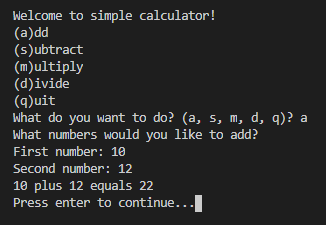

# Exercise 2: Simple Calculator!

This app will be a very simple calculator, one that only allows you to add, subtract, multiply, and divide. See an example below:

## Key Python Concepts
* sys.clear
* math
* functions
* if statements